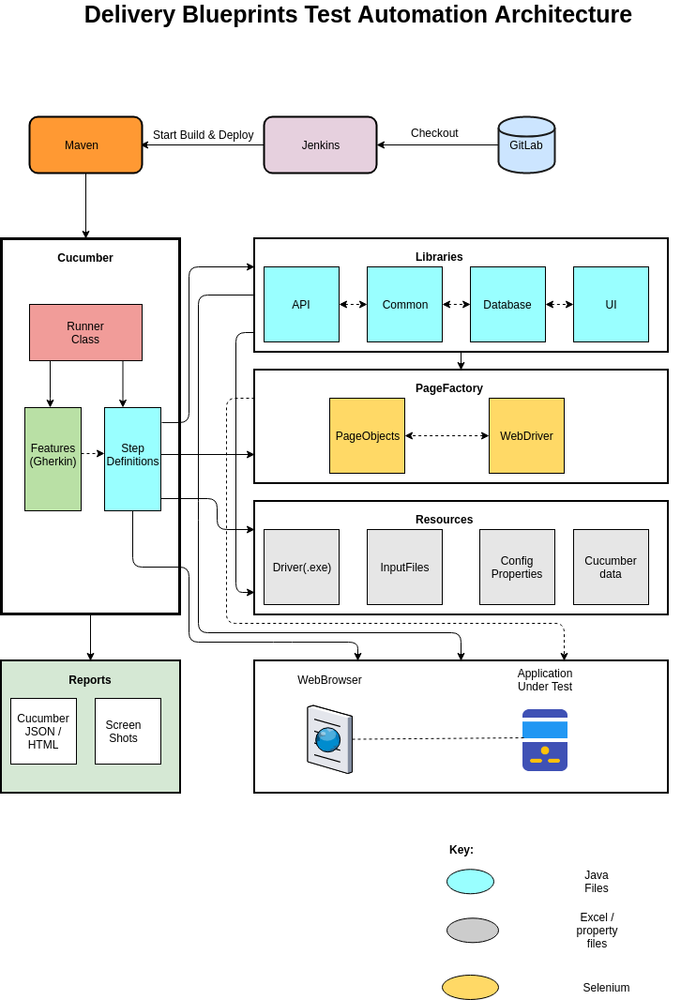

# DB Regression Test Suite:

### Set Up:
Do the following steps to set up the code to run locally:

1) Install Java 11 locally
2) Install maven
3) Install Java IDE (Eclipse, IntelliJ)
4) Install Cucumber, Maven plugin in IDE
5) Clone the below git repository:
https://github.com/sramkuma9/dbRegressionTestAutomationSuite.git
6) Run a mvn clean install for the above cloned repo in turn. This will install them into your local maven repository.

### Input Data:
1) Enter the input data for each feature in the feature file(from resources) 
2) Enter the BNI login details in the config.properties(resources/properties)

### Running:
Run the 'PriorityCases' class from the IDE.

